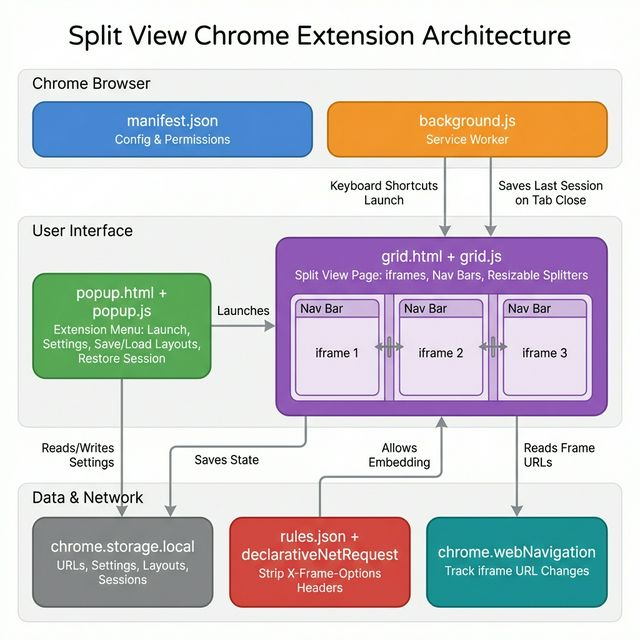

# Split View for Chrome

Split View lets you run multiple websites inside a single Chrome tab.

## Core Features
- Dual view (2 panes), quad view (4 panes), and custom layouts (1-16 panes).
- Drag-resize grid splitters.
- Per-pane navigation controls (back, reload, URL bar).
- **Live URL tracking** — address bar updates automatically when you click links inside panes.
- Two close behaviors:
  - Close and compact horizontally.
  - Close and compact vertically.
- Save named layouts and reload them later.
- **Restore Last Session** — reopen your last split view exactly as it was.
- Dark mode and optional nav bar visibility.

## Popup Controls
- `Quad View (4)`: opens a 4-pane split view.
- `Dual View (2)`: opens a 2-pane split view.
- `Custom panes (1-16)` + `Launch Custom Split`: opens a split view with the requested pane count.
- `Reset Split Sizes`: resets splitter sizes for the active split tab.
- `Restore Last Session`: reopens your last closed split view with all URLs and layout intact.
- `Show Nav Bar`: toggles pane nav bars on/off.
- `Dark Mode`: toggles dark/light appearance.
- `Layout name`: optional name used when saving.
- `Save Current Layout`: saves current split URLs + layout geometry.
- `Load Selected Layout`: launches a saved layout.
- `Delete Selected Layout`: removes a saved layout.

## In-Grid Pane Controls
- `Back`: navigates pane history backward.
- `Reload`: reloads pane URL.
- `Address bar`: enter URL or search query (press Enter). Updates automatically when you click links.
- `Close pane (horizontal)`: closes pane and compacts with row-aligned panes.
- `Close pane (vertical)`: closes pane and compacts with column-aligned panes.

## Keyboard Shortcuts
- `Alt+S`: launch quad view.
- `Alt+D`: launch dual view.
- `Alt+H`: toggle nav bar visibility.

## Architecture

The extension is built on Chrome Manifest V3 and consists of:

| File | Role |
|------|------|
| `manifest.json` | Extension configuration, permissions, commands |
| `background.js` | Service worker — handles keyboard shortcuts, session save on tab close |
| `popup.html/js` | Extension menu — launch views, settings, save/load layouts, restore session |
| `grid.html/js` | Split view page — dynamic grid layout, iframe management, URL tracking |
| `rules.json` | `declarativeNetRequest` rules to strip frame-blocking headers |
| `icons/` | Extension icons (16, 32, 48, 128px) |

### How URL Tracking Works
1. Each iframe has a `load` event listener
2. When user clicks a link inside a pane, the iframe navigates and fires `load`
3. The extension calls `chrome.webNavigation.getAllFrames()` to read the actual current URL
4. The address bar, navigation history, and saved state are all updated

### How Session Restore Works
1. `grid.js` continuously persists the current state (URLs, layout, ratios) to `chrome.storage.local`
2. When a split-view tab is closed, `background.js` saves that state as `lastSession`
3. The popup shows a "Restore Last Session" button with pane count and timestamp
4. Clicking it relaunches the exact layout with all URLs and grid geometry

## Compatibility + Security Considerations
- `allow-same-origin` in iframe sandbox enables login/session flows
- `allow-top-navigation` is disabled to prevent framed sites from hijacking the tab
- `declarativeNetRequest` strips `X-Frame-Options` and `Content-Security-Policy` headers
- Some sites may still refuse to render in iframes due to runtime frame-busting logic

## Data Stored Locally
- UI preferences: dark mode, nav visibility.
- Current split URLs (updated live via webNavigation).
- Saved layouts (name, URLs, pane count, geometry).
- Last session state for restore.
- Temporary tab-scoped split state.

No remote servers are used. No data is collected or transmitted.

## Permissions
| Permission | Why |
|---|---|
| `tabs` | Read open tabs to populate split view |
| `storage` | Save preferences, URLs, layouts locally |
| `declarativeNetRequest` | Strip frame-blocking headers for iframe display |
| `webNavigation` | Track URL changes inside panes for accurate address bar and session save |
| `<all_urls>` | Allow any website to be displayed in split panes |
